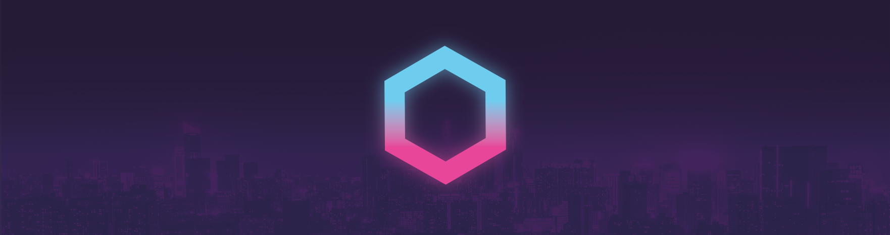
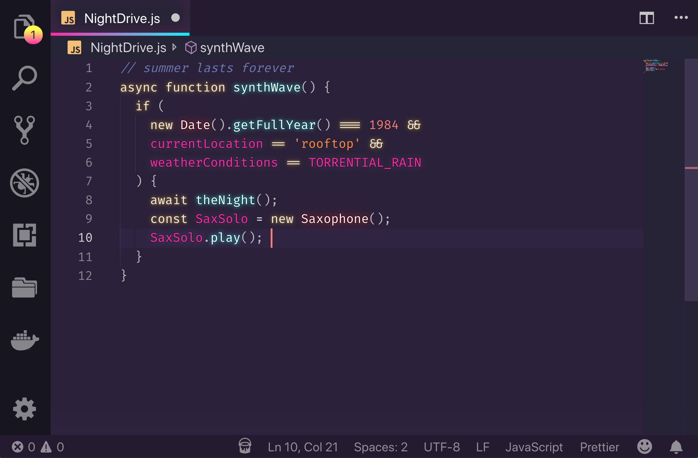

# Kawaii VS Code Color - VS Code Theme



Kawaii VS Code Color is a dark pink and light green pastel-pink VS Code theme. The visual focus comes first: the dark theme leans into neon pink contrast, while the light theme uses soft green and pastel pink. It is inspired by [SynthWave '84](https://github.com/robb0wen/synthwave-vscode) and [Sakura Theme](https://github.com/mhiratani/theme-sakura), and was originally forked from [SynthWave '84](https://github.com/robb0wen/synthwave-vscode) by [Robb Owen](https://github.com/robb0wen). This fork keeps the optional Neon Dreams workflow and adds dark/light theme customization, image-backed effects, Settings Sync support, and JSON import/export.



## Features

- Dark theme: `Kawaii VS Code Color`.
- Light theme: `Kawaii VS Code Color Light`.
- Theme-specific color customization for both modes.
- Optional Neon Effect for glow, editor chrome styling, background images, and no-tab logo replacement.
- Local editor background image with opacity and fit area controls.
- Local no-tab logo replacement with opacity control.
- `Random Neko` image source powered by [Nekos.moe](https://nekos.moe).
- Settings bundle export/import as JSON.
- Settings bundle save/import through VS Code Settings Sync global state.

## Installation

### from visualstudio marketplace


### development

Package the extension:

```powershell
npm run build:local
```

### from VSIX

Install the generated VSIX in VS Code:

```powershell
code --install-extension .\dist\kawaii-vscode-color-0.1.20.vsix --force
```

For VS Code Insiders:

```powershell
code-insiders --install-extension .\dist\kawaii-vscode-color-0.1.20.vsix --force
```

You can also install it from the Extensions view with `Install from VSIX...`.

## Enable the Theme

1. Open the Command Palette.
2. Run `Preferences: Color Theme`.
3. Select `Kawaii VS Code Color` or `Kawaii VS Code Color Light`.

## Open Settings

1. Open the Command Palette.
2. Run `Kawaii VS Code Color: Settings`.
3. Use the side menu to switch between `Home`, `Color Settings`, and `Neon Effect`.

The settings window opens as a normal editor tab.

## Settings Window

| Area | Purpose |
| --- | --- |
| `Home` | Shows project references and external links used by the theme. |
| `Color Settings` | Changes theme mode, color overrides, image-backed effects, sync, export, and import. |
| `Neon Effect` | Enables or disables the unsupported VS Code workbench patch used for glow and image effects. |

## Color Settings

The `Color Settings` page edits local user overrides for the selected theme mode.

- Dark edits are written to `[Kawaii VS Code Color]`.
- Light edits are written to `[Kawaii VS Code Color Light]`.
- Workbench colors are stored in `workbench.colorCustomizations`.
- Syntax colors are stored in `editor.tokenColorCustomizations`.
- Packaged theme source files are not modified.

Use `Reset` to remove one custom color. Use `Reset All` to remove all color customizations for the selected theme mode.

## Image Customization

The `Color Settings` page can store one editor background image and one no-tab logo replacement.

| Setting | Behavior |
| --- | --- |
| `Upload Image` | Selects a local editor background image. |
| `Upload Logo` | Selects a local no-tab logo image. |
| `Random Neko` | Fetches a non-NSFW random image from Nekos.moe and uses it as the selected image input. |
| `Download Image` / `Download Logo` | Saves the current stored image with a Save As dialog. |
| `Remove Image` / `Remove Logo` | Removes the stored image input. |
| `Opacity` | Controls the injected image layer opacity. |
| `Fit Area` | Fits the editor background image inside full, half, or corner regions. |

Supported image formats:

- PNG
- JPG/JPEG
- WEBP
- SVG

Images are capped at 2 MB. If preview or injected effects fail, try a smaller image resolution because image previews and Neon Effect injection use data URLs.

Image changes do not auto-apply. Click `Apply Effects`, then reload VS Code when prompted. If the editor does not refresh cleanly, close and open VS Code manually.

## Sync, Export, and Import

| Button | Behavior |
| --- | --- |
| `Save to VSSync` | Saves the current Kawaii VS Code Color settings bundle into VS Code synced extension global state. |
| `Import VSSync` | Restores the synced Kawaii VS Code Color settings bundle on another synced installation. |
| `Export As` | Saves the current settings bundle as a JSON file with a Save As dialog. |
| `Import` | Opens a JSON file picker and applies a previously exported settings bundle. |

The settings bundle includes:

- Active theme mode.
- Dark and light workbench color overrides.
- Dark and light token color overrides.
- Neon brightness and glow disable setting.
- Editor background image metadata, image bytes, opacity, and fit area.
- No-tab logo image metadata, image bytes, and opacity.

VS Code Settings Sync must be enabled in VS Code for `Save to VSSync` / `Import VSSync` to move data between machines.

## Neon Effect

VS Code color themes do not natively support text glow, editor background images, no-tab logo replacement, or arbitrary editor CSS. Those effects are provided by the optional Neon Effect path.

The Neon Effect modifies VS Code workbench files by adding a generated `neondreams.js` script reference with a refresh key. Use it with caution:

- Administrator permissions may be required on Windows.
- VS Code may show an unsupported or corrupted installation warning.
- VS Code updates can overwrite the patch.
- Disable the effect before troubleshooting editor startup or workbench rendering issues.

Enable or disable the effect:

1. Run `Kawaii VS Code Color: Settings`.
2. Open `Neon Effect`.
3. Use `Enable Neon Effect` or `Disable Neon Effect`.
4. Reload VS Code when prompted.

If VS Code shows the corruption warning, the `Neon Effect` page includes the official VS Code FAQ link and an optional checksum-fix community workaround. The supported recovery path is to disable Neon Effect and reinstall or repair VS Code so the modified workbench files are replaced.

## VS Code Settings

Customize glow brightness:

```json
{
  "kawaii_synthwave.brightness": 0.45
}
```

The value should be a number from `0` to `1`. The default is `0.45`.

Keep editor chrome updates but disable token glow:

```json
{
  "kawaii_synthwave.disableGlow": true
}
```

After changing either setting, open `Kawaii VS Code Color: Settings`, apply the Neon Effect again, and reload VS Code.

## Development

Out-of-the-box checks:

```powershell
npm pkg get name version publisher dependencies devDependencies engines
node --check scripts\build-color-theme.js
npm run build:theme
node --check src\extension.js
node --check src\settings.js
node --check src\js\theme_template.js
```

Theme color workflow:

- Keep `themes/kawaii_synthwave-color-theme.json` as the protected dark base theme.
- Keep `themes/kawaii_synthwave-color-theme-light.json` as the protected light base theme.
- Put dark palette changes in `themes/kawaii_synthwave-color-theme-overrides.json`.
- Put light palette changes in `themes/kawaii_synthwave-color-theme-light-overrides.json`.
- Run `npm run build:theme` to regenerate both generated theme JSON files.
- VS Code loads generated themes through `package.json.contributes.themes`.

Manual theme test:

1. Open this repository in VS Code.
2. Run `npm run build:theme`.
3. Press `F5` to launch the Extension Development Host.
4. Select `Kawaii VS Code Color` or `Kawaii VS Code Color Light`.
5. Inspect representative files and use `Developer: Inspect Editor Tokens and Scopes` for token rules.

Live Neon Effect testing is possible from the Extension Development Host, but it patches the VS Code installation used by that host. Prefer a disposable VS Code installation or VS Code Insiders.

## Publishing

Before publishing this fork:

- Ensure `package.json.publisher` is the intended Marketplace publisher.
- Ensure `package.json.name` is `kawaii-vscode-color` or another valid Marketplace identifier.
- Ensure repository links point to the fork.
- Package to `./dist` with `npm run build:local`.
- Publish only from an account authorized for the configured publisher.

## References

- Fork repository: [karolva/kawaii-vscode-color](https://github.com/karolva/kawaii-vscode-color)
- Upstream base: [robb0wen/synthwave-vscode](https://github.com/robb0wen/synthwave-vscode)
- Original Marketplace extension: [SynthWave '84](https://marketplace.visualstudio.com/items?itemName=RobbOwen.synthwave-vscode)
- Light theme inspiration: [mhiratani/theme-sakura](https://github.com/mhiratani/theme-sakura)
- Nekos.moe site: [nekos.moe](https://nekos.moe)
- Nekos.moe API docs: [docs.nekos.moe](https://docs.nekos.moe/)
- Nekos.moe image routes: [Images / Posts](https://docs.nekos.moe/images.html)
- Random Neko downloader inspiration: [NyarchLinux/CatgirlDownloader](https://github.com/NyarchLinux/CatgirlDownloader)
- VS Code Color Theme guide: [Color Theme](https://code.visualstudio.com/api/extension-guides/color-theme)
- VS Code Theme Color reference: [Theme Color](https://code.visualstudio.com/api/references/theme-color)
- VS Code theme customization: [Customize a color theme](https://code.visualstudio.com/docs/configure/themes#_customize-a-color-theme)
- VS Code Settings Sync extension state: [Common Capabilities - Data Storage](https://code.visualstudio.com/api/extension-capabilities/common-capabilities)

## Attribution

Kawaii VS Code Color is based on [SynthWave '84](https://github.com/robb0wen/synthwave-vscode). The original theme, glow concept, and much of the historical implementation came from Robb Owen's project.

Kawaii VS Code Color Light is inspired by [Sakura Theme](https://github.com/mhiratani/theme-sakura), a soft pastel VS Code theme by [mhiratani](https://github.com/mhiratani). Sakura Theme is released under the [MIT License](https://github.com/mhiratani/theme-sakura/blob/main/LICENSE).

The Random Neko image flow was inspired by [NyarchLinux/CatgirlDownloader](https://github.com/NyarchLinux/CatgirlDownloader), which uses Nekos.moe as one of its image sources.

The original SynthWave '84 README also credited:

- [Sarah Drasner](https://twitter.com/sarah_edo) and her CSS-Tricks theme tutorial.
- [Wes Bos](https://twitter.com/wesbos) and the [Cobalt2 VS Code theme](https://github.com/wesbos/cobalt2-vscode).
- [Fira Code](https://github.com/tonsky/FiraCode), used in the original screenshots.
- Banner cityscape image from [Unsplash](https://unsplash.com/photos/DxHR8K5Egjk).
